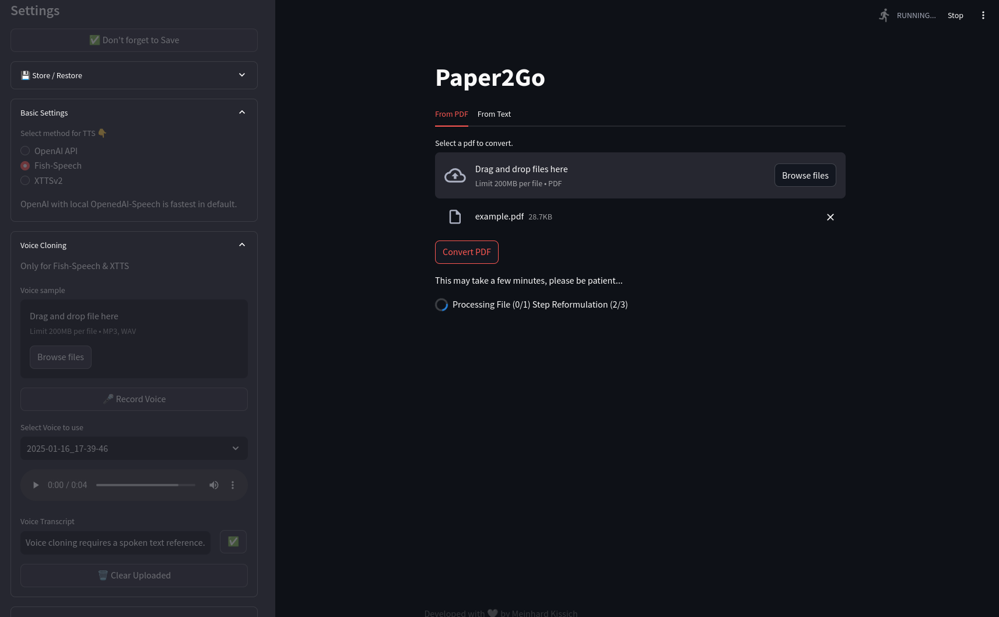

# Paper2Go



Paper2Go converts written documents into speech. It primarily aims to convert research papers in PDF format to a summary that can be listened to on the go. All steps can be performed with self-hosted software.

Through the Web App, the document can be uploaded. Paper2Go uses [Docling](https://github.com/DS4SD/docling) to extract the text and store it in Markdown format. Further, each section is summarized and re-formulated by an LLM (local [Ollama](https://github.com/ollama/ollama)) model to be understandable without visually seeing the document (e.g., explaining formulas and tables). Once done, the sections are individually converted to speech using [Fish-Speech](https://github.com/fishaudio/fish-speech) or [XTTSv2](https://huggingface.co/coqui/XTTS-v2) and named by the enumerated section titles. The audio files are combined in a zip file and can be downloaded via the Web App.

> [!IMPORTANT]  
> :triangular_ruler: Please note that Paper2Go is work in progress.

## 🎨 Key Features

<ul>
<li style="list-style-type: '🔊 '"> Convert PDF documents to an AI-summarized audiobook
<li style="list-style-type: '💿 '"> Download the audio files separated by section names as ZIP archive
<li style="list-style-type: '⚙️ '"> Adjust model parameters directly in the Web app
<li style="list-style-type: '🎤 '"> Upload voices or record your own voice directly in Web app
<li style="list-style-type: '💾 '"> Download & restore configurations
</ul>

## 🚀 Quickstart

You can run the application in a Docker container using the provided `docker-compose.yml` file or run it natively. Either way, you need to clone the following repos first and agree to the model licenses.

Clone the repo.

```shell
https://github.com/meiniKi/Paper2Go.git
```

Clone the models into `models`.

```shell
# install Git Large File Storage, see: https://docs.github.com/en/repositories/working-with-files/managing-large-files/installing-git-large-file-storage
git lfs install
cd models
https://github.com/fishaudio/fish-speech.git
git clone https://huggingface.co/fishaudio/fish-speech-1.5
git clone https://huggingface.co/coqui/XTTS-v2
```

Download the XTTS-v2 model. Run `xtts.py` to check your installation and download the model. You may have to access the license agreement while running the script.

```shell
cd models
python xtts.py
```

### Docker

Make sure all necessary drivers and NVIDIA/CUDA tools are installed on your system. You may want to take a look at [this](https://docs.nvidia.com/datacenter/cloud-native/container-toolkit/latest/install-guide.html#installing-the-nvidia-container-toolkit) and [this](https://developer.nvidia.com/cuda-downloads) pages. Then, restart the docker.

```bash
sudo apt install -y nvidia-cuda-toolkit
sudo apt install -y nvidia-open
sudo systemctl restart docker
```

For Redis you need to apply the following modification.

```
'vm.overcommit_memory = 1' to /etc/sysctl.conf and then reboot or run the command 'sudo sysctl vm.overcommit_memory=1' for this to take effect.
```

You can build the containers and start them.

```bash
docker compose up --build -d
```

To rebuild the contains, use:
```bash
docker compose up --build --force-recreate  -d 
```

You can now access the Web UI via `0.0.0.0:8501`, i.e., the `<IP>:8501` if you are accessing remotely.

### Native Installation

Create a virtual environment, activate it, and install the requirements.

```shell
cd <repo path>
python3.10 -m venv .venv
source .venv/bin/activate
./install_dep.sh
```

Run redis, e.g., as a docker container.
```shell
cd redis
docker compose up -d
cd ..
```

Start the worker.
```shell
celery -A tasks worker --loglevel=warning
```

Start the application in another terminal.
```shell
streamlit run app.py
```

You should now be able to access the Web UI via IP and port.


## 🔧 Troubleshooting

### The voice record feature does not record the microphone.
Take a look at "treat insecure origin as secure" in Chrome when you access the Web app without an HTTPS connection.
